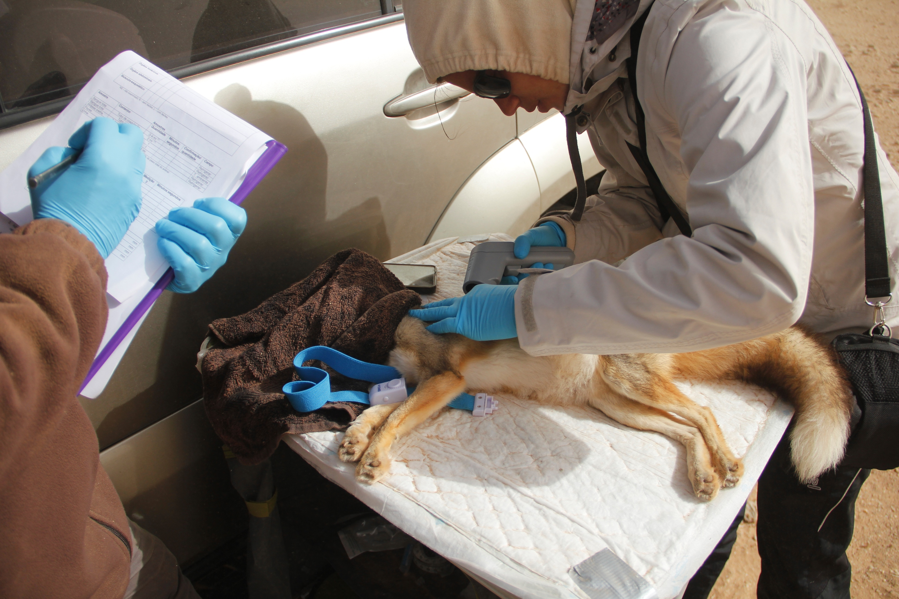
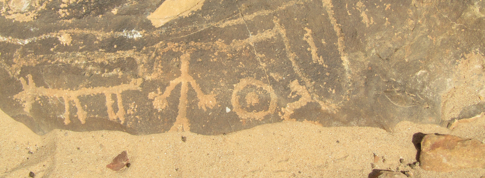

****
#### Adaptation in extreme terrestrial environments

Deserts are bellwethers for climate change and are outstanding natural laboratories to study biological adaptation to extreme climatic and physical conditions. For my dissertation research I have been applying an interdisciplinary approach to assess the relative roles of demography and natural selection in the evolution of North African desert-dwelling fox species. By integrating ecological and evolutionary aspects of these species, and combining eco-physiological data with cutting-edge genomics, we expect to: i) identify and characterize the functional roles of the most relevant genes involved in adaptation to extreme arid conditions, ii) provide insights into the historical events and evolutionary processes responsible for adaptation in deserts.

Fore more information click on [HOTFOXES](https://cibio.up.pt/people/details/mrgodinho/projects/584)

##### Photo by [Monia Nakamura](https://cibio.up.pt/people/details/monian). 

****

 

###### Rock art, Western Sahara, 2018. Joana L. Rocha